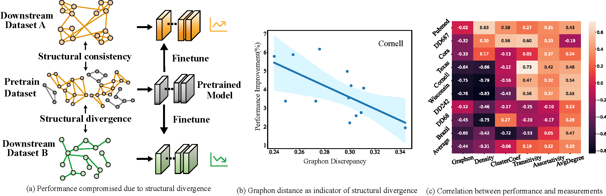

# Fine-tuning Graph Neural Networks by Preserving Graph Generative Patterns
## G-Tuning
This repo is the implementation of paper “Fine-tuning Graph Neural Networks by Preserving Graph Generative Patterns" accepted by AAAI' 24.

Hope to present this work smoothly in Vancouver in February, 2024!

## Motivation
We identify the generative patterns of downstream graphs as a crucial aspect in narrowing the gap between pre-training and fine-tuning.

## Architecture
Building upon on our theoretical results, we design the model architecture **G-Tuning** to efficiently reconstruct graphon as generative patterns with rigorous generalization results.

## Plug and play
Our method can be used in any graph pre-training pipelines.

Specifically, our implementation is split into two-parts: GCC-based and Mole-based.

## Status
Now we have updated our model on GCC version, namely the Table 2 in our paper. 

**More code and appendix** will be uploaded within this month. Our full paper will be released on arXiv soon. :)

## Contact
If you have any question about the code or the paper, feel free to contact me through [email](mailto:yifeisun@zju.edu.cn).

